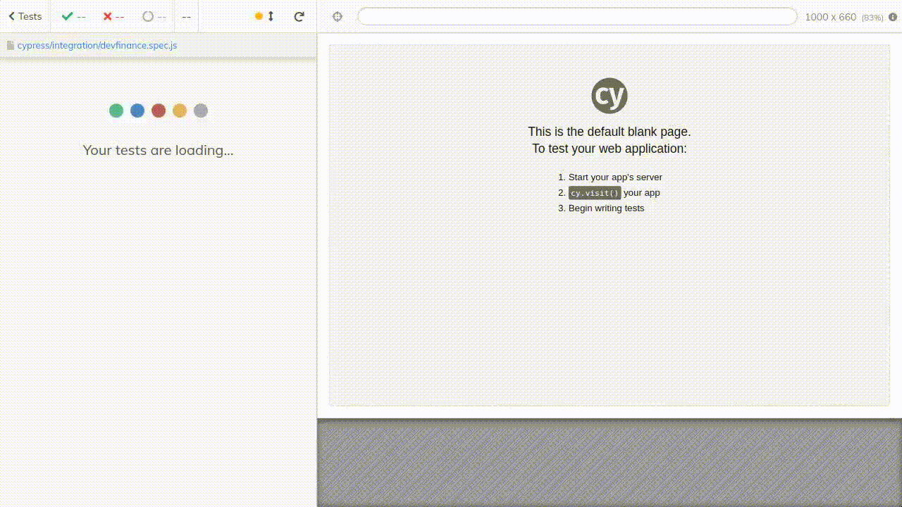

### Demonstração

### Referencias
- https://github.com/samlucax/cypress-learning-checklist
- https://www.youtube.com/c/Agilizei

### npx -> node package executor

1. criar a estrutura de pastas (1st vez)
2. abrir cypress

